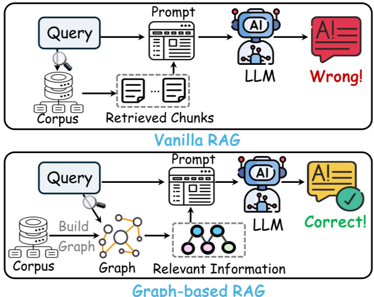

# Knowledge Graph Based Retrieval-Augmented Generation (RAG) System for U.S. SEC Filings

Author: Omkar Bare

## Project Overview

This project implements a sophisticated Retrieval-Augmented Generation (RAG) pipeline leveraging knowledge graphs built from U.S. Securities and Exchange Commission (SEC) filings data. The system is designed to enable advanced question-answering (QA) capabilities over regulatory filings, specifically Form 10-K and Form 13 filings, for publicly traded companies—demonstrated on NetApp, Inc.

The solution combines Neo4j graph database technology with LangChain and OpenAI language models to build a knowledge graph that structurally represents entities and relationships in SEC filings. It supports semantic search through vector embeddings and graph-based query augmentation for improved QA performance.

Why Knowledge Graph?
1. Explicit Facts — KGs preserve key details by capturing facts directly as nodes and edges, instead of condensed into opaque vectors
2. Multi-Hop Reasoning — Queries can traverse relationships, and infer across multiple steps, to connect and derive facts from diverse sources.
3.Contextual Details — KG entities possess rich attributes like descriptions, aliases, and metadata that provide crucial context.

## Data Sources

- **SEC Form 10-K**: Annual reports filed by publicly traded companies containing comprehensive business descriptions, financial statements, and risk factors. Data retrieved in JSON format from SEC EDGAR.
- **SEC Form 13**: Reports filed by investment management firms disclosing holdings in companies, retrieved as CSV from SEC EDGAR.

The data is specifically focused on NetApp, Inc., showcasing a practical use case and demonstrating the model on real financial regulatory data.

## Key Features

- **Document Chunking**: Large filing texts are split into meaningful chunks for efficient embedding and retrieval.
- **Knowledge Graph Construction**: Nodes created for filing chunks, companies, managers, and relationships such as ownership and filing hierarchies using Neo4j.
- **Vector Embedding and Indexing**: Each text chunk is embedded using OpenAI embeddings and indexed in Neo4j for similarity search.
- **Relationship Modeling**: Relationships such as NEXT (to order chunks), PART-OF (chunk to form), FILED (company to form), and OWNS-STOCK-IN (manager to company) enable rich graph traversal and querying.
- **Retrieval-Augmented QA Pipeline**: Integration of LangChain `RetrievalQAWithSourcesChain` and `GraphCypherQAChain` for answering natural language questions with source-backed answers.
- **Cypher Query Generation**: Dynamic construction of Cypher queries for graph database interaction based on user queries, enhancing explainability.
- **Interactive Q&A**: Ability to query investor holdings, company info, and filing details in a conversational manner.

## Technologies Used

- **Python** with Jupyter/Colab notebooks
- **Neo4j** graph database for knowledge graph storage and querying
- **LangChain** framework for chaining language models and retrieval components
- **OpenAI embeddings and language models (GPT-4 variant)**
- **Google Colab** environment for development and testing
- **SEC EDGAR public datasets**

## Project Structure

- [Form10k_SEC_Project_OmkarBare.ipynb](https://colab.research.google.com/drive/11brXxZGt7MTb0XknfKsT-FpUEP8l2gQE?usp=sharing): 
  - Parses and chunks Form 10-K documents.
  - Creates Neo4j nodes and vector embeddings from filing chunks.
  - Sets up a vector index for semantic similarity search.

- [Form13_SEC_Project_OmkarBare.ipynb](https://colab.research.google.com/drive/13GCkyUvMs42voBzg_3dwyJ4M26iBMVRW?usp=sharing): 
  - Parses and processes Form 13 filings.
  - Builds nodes for companies and managers.
  - Establishes relationships between managers, companies, and filings.
  - Creates graph schema with constraints and indexes.

- [RAG_Pipeline_SEC_Project_OmkarBare.ipynb](https://colab.research.google.com/drive/1UnQEfa66TtXmlHAM-IfC-R0ZahIcFEl5?usp=sharing): 
  - Combines data and relationships from Form 10-K and Form 13.
  - Implements the RAG pipeline for question answering.
  - Provides example queries showcasing investor analysis and filing content QA.
  - Uses LangChain's `RetrievalQAWithSourcesChain` and graph-based QA chain with Cypher query generation.

## Graph Structure

The Neo4j graph struture implemented in this project models relationships between document sections, companies, company filings, and asset ownership. It includes node categories for "Chunk," "Company," "Form," and "Manager," with relationship types like PART_OF, NEXT, OWNS_STOCK_IN, and FILED to capture document structure and corporate interactions. The below graph visually illustrates how document chunks link to sections, companies file forms, and managerial or stock ownership ties exist between financial entities.

Sample relationship betwen nodes in the neo4j graph database:

## Results and Insights

- Demonstrated complex query answering about company business and investor holdings.
- Provided explainable QA responses backed by source filing documents and graph traversals.

## Conclusion

This project demonstrates an end-to-end capability to extract, organize, and query complex financial filing data using modern knowledge graphs and retrieval-augmented generation methods. It highlights the potential of combining graph databases with LLMs for enhanced financial data analysis and decision-making support.
